# UD5-P1 . connexiones de redes y gestion de recursos en linux
## Ejercicio 1

### Comando ejecutado
ip a

### Captura
ip a

### Explicación

El comando `ip a` muestra las interfaces de red del sistema.

La interfaz activa es **enp0s3** porque está en estado UP.

La dirección IP es **10.0.2.15** (inet), y la dirección MAC es **08:00:27:62:6a:27** (link/ether).

La red a la que pertenece es **10.0.2.0/24**.

También aparece la interfaz **lo**, que es la de uso interno del sistema.
## Ejercicio 2

### Comandos ejecutados

```bash
ip addr
ip route 
```
## Captura
ip addr
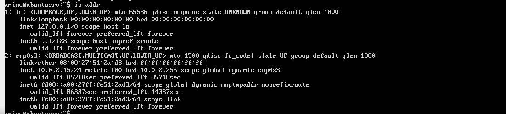
ip route
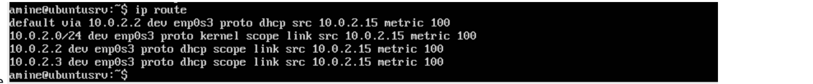


### Explicación
La red local configurada es **10.0.2.0/24**, ya que la dirección IP asignada es **10.0.2.15** con máscara de red 255.255.255.0.

La interfaz utilizada para acceder a la red es **enp0s3**, porque es la que aparece en estado **UP** y tiene asignada la dirección IP.

Sí existe una puerta de enlace configurada. En la salida del comando `ip route` aparece la línea:

**default via 10.0.2.2 dev enp0s3**

Esto indica que la puerta de enlace es **10.0.2.2**, utilizada para acceder a otras redes.

El comando `ip addr` muestra la configuración de las interfaces de red. Los campos más importantes son:

- **inet**: indica la dirección IP (por ejemplo 10.0.2.15)
- **link/ether**: muestra la dirección MAC
- **state UP**: indica que la interfaz está activa
- **lo**: es la interfaz de loopback (uso interno del sistema)

El comando `ip route` muestra la tabla de rutas del sistema. Los campos más importantes son:

- **default**: indica la ruta por defecto (puerta de enlace)
- **via**: indica la dirección de la puerta de enlace
- **dev**: indica la interfaz utilizada
- **src**: muestra la dirección IP de origen

## Ejercicio 3: Configuración del hostname

### Comandos ejecutados

```bash
hostname
sudo hostnamectl set-hostname srv01
hostname
```
## captura


## Explicación

El comando hostname permite ver el nombre actual del sistema.
Se ha cambiado el nombre del equipo utilizando el comando hostnamectl set-hostname srv01.
Después se ha comprobado el cambio ejecutando nuevamente hostname.
El hostname es importante en una red porque permite identificar de forma única cada equipo, facilitando la comunicación y la administración de los sistemas.

## Ejercicio 4 – Configuración de dirección IP estática
## Comando
```bash
sudo nano /etc/netplan/01-netcfg.yaml
sudo netplan apply
ip a
```
## Captura


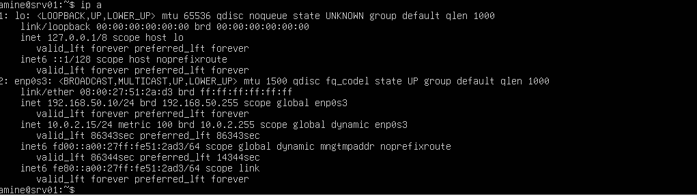
# Explicacion
Se ha configurado una dirección IP estática mediante Netplan.
dhcp4: no → desactiva DHCP
addresses → define la IP (192.168.50.10/24)
gateway4 → puerta de enlace (192.168.50.1)
nameservers → DNS (8.8.8.8)

## Ejercicio 5 – Verificación de conectividad entre máquinas

### Comandos ejecutados

Desde el cliente (cli01):

```bash
ping 192.168.50.10
```

Desde el servidor (srv01):

```bash
ping 192.168.50.20
```

---

### Capturas

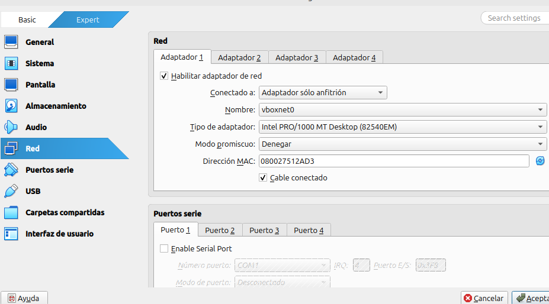
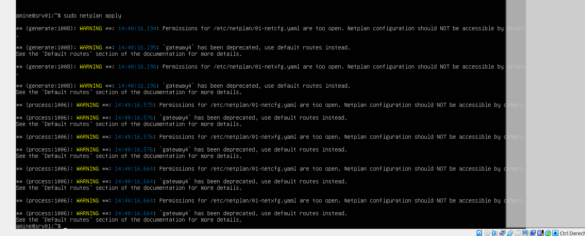
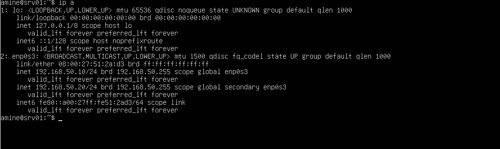

---

### Explicación

El comando `ping` se utiliza para comprobar la conectividad entre dos equipos en una red.
Funciona enviando paquetes ICMP al equipo destino y esperando una respuesta.

Si el equipo responde, significa que hay conexión entre ambos dispositivos.

---

### Resultados obtenidos

Sí, se reciben respuestas del otro equipo, lo que indica que la comunicación entre el cliente y el servidor es correcta.

Ejemplo de salida:

```bash
64 bytes from 192.168.50.10: icmp_seq=1 ttl=64 time=0.5 ms
64 bytes from 192.168.50.10: icmp_seq=2 ttl=64 time=0.4 ms
```

---

### Análisis de la salida

* **64 bytes** → tamaño del paquete enviado
* **icmp_seq** → número de secuencia del paquete
* **ttl (Time To Live)** → número de saltos permitidos
* **time** → tiempo que tarda en responder (latencia)

---

### Estadísticas

Al detener el comando con `Ctrl + C`, se muestran los resultados finales:

```bash
4 packets transmitted, 4 received, 0% packet loss
```

* **packets transmitted** → paquetes enviados
* **received** → paquetes recibidos
* **packet loss** → pérdida de paquetes (debe ser 0%)

---

### Conclusión

La conectividad entre las dos máquinas es correcta, ya que se reciben todos los paquetes enviados sin pérdidas.

---
## Ejercicio 6 – Configuración de resolución de nombres local

### Comandos ejecutados

```bash
sudo nano /etc/hosts
ping srv01
ping cli01
```
## Explicación

Se ha editado el archivo /etc/hosts para configurar la resolución de nombres de forma local.

Se han añadido las siguientes entradas:

192.168.50.10 srv01
192.168.50.20 cli01

El archivo /etc/hosts permite asociar nombres de host a direcciones IP sin necesidad de utilizar servidores DNS.

Cuando se introduce un nombre como srv01, el sistema consulta primero este archivo y lo traduce automáticamente a su dirección IP correspondiente.

## Funcionamiento

Al ejecutar:

ping srv01

El sistema resuelve el nombre srv01 a la dirección IP 192.168.50.10.

De igual forma:

ping cli01

Se resuelve el nombre cli01 a la IP 192.168.50.20.

Resultado

Se reciben respuestas correctamente, lo que indica que la resolución de nombres funciona de forma adecuada.

## Capturas
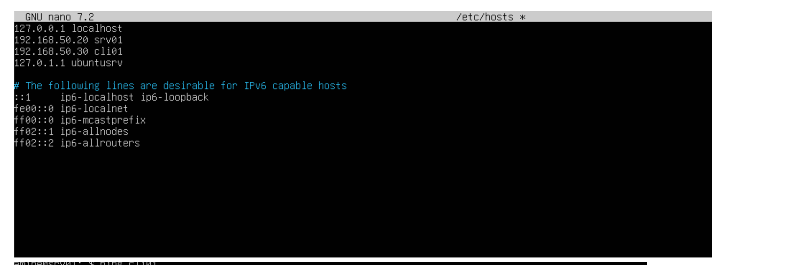
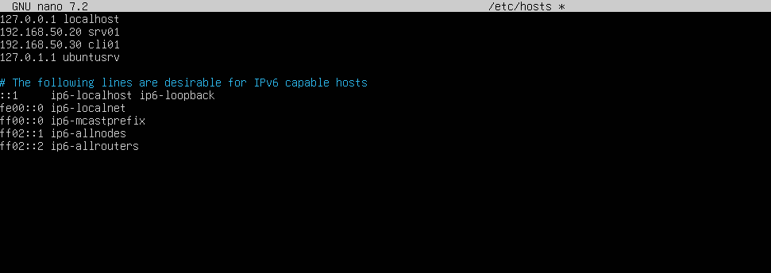

## 7. Tabla de rutas del sistema

Para comprobar la tabla de rutas del sistema se ha ejecutado el siguiente comando:

```
ip route
```

Este comando muestra las rutas que utiliza el sistema para enviar paquetes a otras redes.

En la salida obtenida aparecen principalmente dos tipos de rutas:

- La ruta por defecto (**default**), que indica la puerta de enlace utilizada para acceder a redes externas (Internet).  
- La red local (**192.168.50.0/24**), que corresponde a la red interna configurada en la máquina.

La interfaz utilizada para acceder a Internet es **enp0s3**, mientras que la red local utiliza la interfaz **enp0s8**.

Cada línea de la tabla contiene información relevante:
- **Destino**: red o dirección a la que se quiere llegar.  
- **via**: dirección de la puerta de enlace.  
- **dev**: interfaz de red utilizada.  
- **src**: dirección IP de origen.  
- **metric**: prioridad de la ruta (cuanto menor, mejor).  

En conclusión, la tabla de rutas permite entender cómo el sistema decide por dónde enviar el tráfico de red.

### Fuentes consultadas
- Manual de Linux: `man ip`
- Documentación oficial de Ubuntu sobre redes
## CApturas
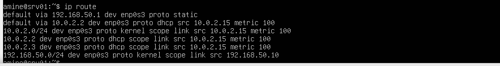

## Ejercicio8. Identificación de puertos y servicios activos

Para comprobar los puertos abiertos en el sistema se ha ejecutado el siguiente comando:
```
ss-tuln
```

Este comando permite ver los puertos en escucha y los servicios activos en el sistema.

En la salida aparecen varios puertos abiertos, por ejemplo:
- **22** → servicio SSH  
- **68** → DHCP  

Las columnas muestran la siguiente información:
- **Netid**: protocolo utilizado (TCP o UDP)  
- **State**: estado del puerto (LISTEN)  
- **Recv-Q / Send-Q**: colas de recepción y envío  
- **Local Address:Port**: dirección y puerto local  
- **Peer Address:Port**: dirección remota  

En cuanto a los protocolos utilizados:
- **TCP** → orientado a conexión (ej: SSH)  
- **UDP** → sin conexión (ej: DHCP)  

En conclusión, el comando `ss` permite identificar qué servicios están activos y qué puertos están abiertos en el sistema.


### captura

# Ejercicio 9. Instalación y configuración del servicio SSH

Para instalar el servicio SSH en el servidor se han ejecutado los siguientes comandos:
````
sudo apt update
sudo apt install openssh-server
`````
A continuación, se ha comprobado el estado del servicio con:

Este comando permite verificar si el servicio está activo y funcionando correctamente.
````
sudo systemctl status ssh
````
Para comprobar que el puerto está abierto se ha ejecutado:
```
ss -tuln
```
# Explicacion
El servicio instalado es **OpenSSH Server**, que permite el acceso remoto seguro a un equipo mediante el protocolo SSH.

Tras comprobar el estado del servicio con `systemctl status ssh`, se observa que está activo y en funcionamiento.

Al ejecutar `ss -tuln`, se identifica:
- **Puerto 22 (TCP)** → servicio SSH activo, permite conexiones remotas al servidor  

Esto confirma que el sistema está escuchando conexiones en ese puerto.

Las columnas del comando `ss` indican:
- **Netid**: protocolo utilizado (TCP o UDP)  
- **State**: estado del puerto (LISTEN)  
- **Recv-Q / Send-Q**: colas de datos  
- **Local Address:Port**: dirección y puerto local  
- **Peer Address:Port**: dirección remota  

En cuanto al protocolo utilizado:
- **TCP** → protocolo orientado a conexión, utilizado por SSH para garantizar una comunicación segura  

En conclusión, el servicio SSH permite administrar el servidor de forma remota y segura a través del puerto 22.
## Caprutras

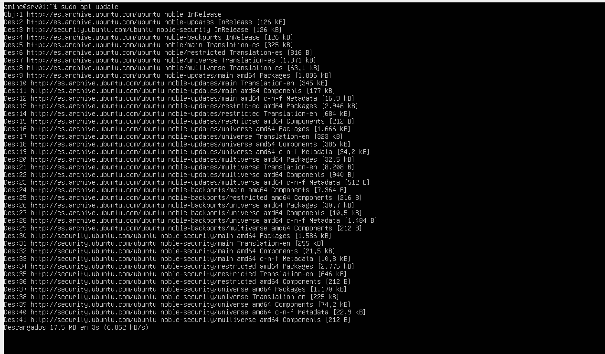
/Users/user/Downloads/Captura de pantalla -2026-04-15 17-05-10 (1).png


## Ejercicio 10. Acceso remoto al servidor

Para acceder de forma remota al servidor desde el cliente se ha ejecutado el siguiente 
```
comando:
ssh usuario@192.168.50.10
```
Una vez establecida la conexión, se han ejecutado:
```
whoami
hostname
```

Estos comandos permiten comprobar el usuario conectado y la máquina en la que se están ejecutando.

### captura


## Ejercicio 11. Análisis del estado de las interfaces

Para comprobar el estado de las interfaces de red se ha ejecutado el siguiente comando:
```
ip link
```

Este comando permite ver las interfaces de red disponibles en el sistema y su estado.

En la salida aparecen interfaces como:
- **lo** → interfaz de loopback  
- **enp0s3** → interfaz de red principal  
- **enp0s8** → interfaz de red secundaria  

El estado de cada interfaz puede ser:
- **UP** → la interfaz está activa  
- **DOWN** → la interfaz está desactivada  

### Explicación

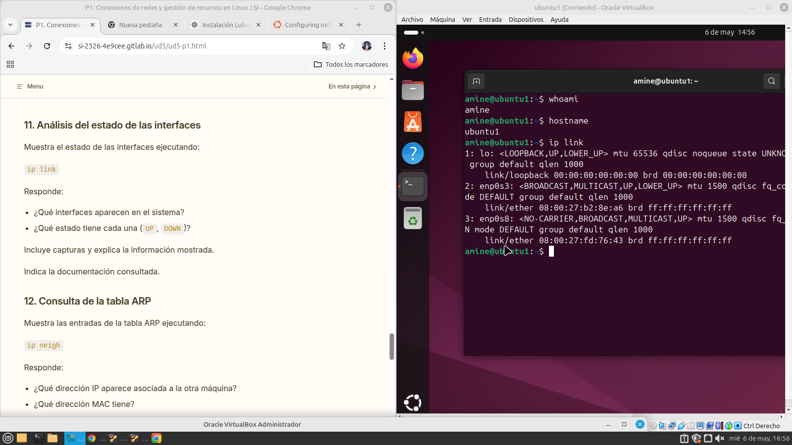

### Conclusión

El comando `ip link` permite identificar las interfaces de red del sistema y comprobar si están activas o no.
## Ejercicio 12. Consulta de la tabla ARP

Para comprobar la tabla ARP se ha ejecutado el siguiente comando:

ip neigh


Este comando muestra la relación entre direcciones IP y direcciones MAC en la red local.

### Explicación

La tabla ARP permite asociar direcciones IP con direcciones MAC dentro de una red local.

- La **IP** identifica el equipo a nivel lógico  
- La **MAC** identifica la tarjeta de red físicamente  

Cuando un equipo quiere comunicarse con otro en la misma red, utiliza ARP para obtener su dirección MAC.

### Conclusión

El comando `ip neigh` permite comprobar la correspondencia entre IP y MAC en la red.


## Ejercicio 13. Transferencia de archivos entre máquinas

Para crear el archivo en el cliente:

nano prueba.txt


Para copiar el archivo al servidor:

scp prueba.txt usuario@192.168.50.10:/home/usuario


### Explicación

El comando `scp` permite copiar archivos entre equipos a través de SSH de forma segura.

- **origen** → archivo en el cliente  
- **destino** → ruta en el servidor  

La transferencia se realiza mediante cifrado, garantizando la seguridad de los datos.

En el servidor se puede comprobar que el archivo se ha copiado correctamente accediendo a la ruta indicada.


### Conclusión

El comando `scp` permite transferir archivos de forma segura entre máquinas conectadas en red.


## Ejercicio 14. Gestión del servicio SSH

Para detener el servicio SSH:

sudo systemctl stop ssh


Para comprobar los puertos:

ss -tuln


Para iniciar nuevamente el servicio:

sudo systemctl start ssh


### Explicación

Al detener el servicio SSH:

- El puerto **22** deja de estar disponible  
- No es posible conectarse desde el cliente  

Al volver a iniciar el servicio:

- El puerto **22** vuelve a estar en estado LISTEN  
- Se permite nuevamente la conexión remota  

Esto demuestra que el servicio SSH controla el acceso remoto al sistema.

### Conclusión

El servicio SSH debe estar activo para permitir conexiones remotas al servidor.


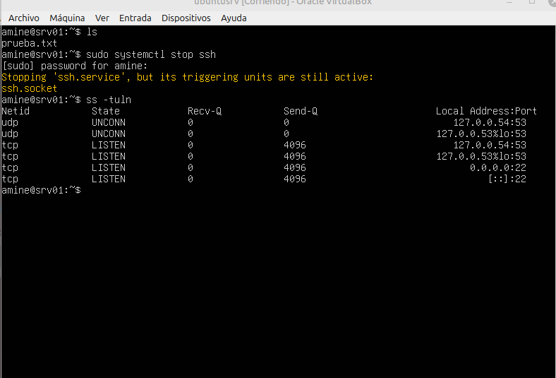


## Ejercicio 15. Reinicio y comprobación de persistencia

Para reiniciar el sistema:

sudo reboot


Para comprobar la configuración:

ip a
hostname
/


.png>)


### Explicación

Tras reiniciar el sistema se comprueba que:

- La **dirección IP** se mantiene configurada correctamente  
- El **hostname** no cambia  
- El servicio **SSH** se inicia automáticamente  

Esto es posible porque la configuración se guarda en archivos del sistema, como netplan y systemd.

### Conclusión

La configuración de red y servicios en Linux es persistente, lo que garantiza que el sistema mantenga su funcionamiento tras reinicios.

