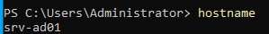
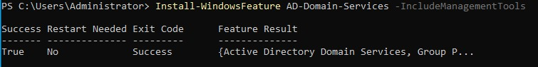
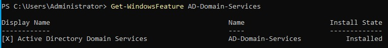
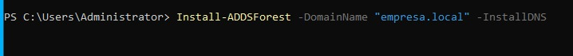

 # P3. Implementación de un dominio Active Directory
 ## Ejercicio 1. Configuración inicial del servidor

Para cambiar el nombre del equipo se ha configurado:
- Nombre del equipo → srv-ad01

Después se ha reiniciado el sistema.

Para comprobar el nombre:

hostname

### Explicación

Se ha configurado el servidor con el nombre **srv-ad01**, que indica que será el controlador de dominio.

El comando `hostname` permite verificar el nombre del equipo.

Este servidor tendrá el papel de:
- Controlador de dominio  
- Gestión de usuarios  
- Administración de recursos  

### Conclusión

El servidor queda identificado dentro de la red como controlador principal del dominio.

## Captura

## Ejercicio 2. Instalación de Active Directory Domain Services

Se ha instalado el rol desde:
- Server Manager → Add Roles and Features  
- Active Directory Domain Services  

### Explicación

El rol **Active Directory Domain Services (AD DS)** permite:

- Gestionar usuarios y equipos  
- Centralizar autenticación  
- Administrar recursos de red  

Este servicio es la base de un dominio Windows.

### Conclusión

El servidor ahora puede funcionar como controlador de dominio.

## Captura

## Ejercicio 3. Promoción a controlador de dominio

Se ha seleccionado:
- Promote this server to a domain controller  
- Add a new forest  

Dominio:
- empresa.local  

### Explicación

Convertir un servidor en controlador de dominio significa:

- Crear un dominio  
- Gestionar autenticación centralizada  
- Almacenar usuarios y políticas  

El dominio **empresa.local** será el entorno de trabajo.

### Conclusión

El servidor pasa a ser el controlador principal del dominio.

## Captura

## Ejercicio 4. Verificación del dominio

Se ha accedido con:
- empresa\Administrator  

Se ha abierto:
- Active Directory Users and Computers  

### Explicación

Se comprueba que existe el dominio **empresa.local**.

En la estructura aparecen:
- Usuarios  
- Equipos  
- Grupos  

Esto representa la organización del dominio.

### Conclusión

El dominio se ha creado correctamente y está operativo.

### Fuentes consultadas
- https://learn.microsoft.com
## Ejercicio 5. Creación de usuarios

Se han creado:
- usuario1  
- usuario2  

### Explicación

Un **usuario de dominio**:
- Se almacena en el servidor  
- Puede acceder desde cualquier equipo del dominio  

Un **usuario local**:
- Solo existe en un equipo  
- No está centralizado  

### Conclusión

Los usuarios de dominio permiten gestión centralizada.

### Fuentes consultadas
- https://learn.microsoft.com
## Ejercicio 6. Carpeta de perfiles móviles

Se ha creado:
- C:\perfiles  

Se ha compartido como:
- perfiles  

### Explicación

Esta carpeta almacenará los perfiles de usuario.

Permite:
- Guardar configuraciones  
- Mantener entorno del usuario  

### Conclusión

El servidor almacenará los perfiles de todos los usuarios.

### Fuentes consultadas
- https://learn.microsoft.com
## Ejercicio 7. Configuración de perfiles móviles

Ruta configurada:
\\srv-ad01\perfiles\%username%

### Explicación

Un perfil móvil:
- Se guarda en el servidor  
- Se carga en cualquier equipo  

Ventajas:
- Movilidad  
- Configuración centralizada  

### Conclusión

Los usuarios tendrán su entorno en cualquier equipo.

### Fuentes consultadas
- https://learn.microsoft.com
## Ejercicio 8. Unión al dominio

Dominio:
- empresa.local  

### Explicación

Unir un equipo al dominio significa:

- Autenticarse contra el servidor  
- Formar parte de la red centralizada  

### Conclusión

El cliente pasa a formar parte del dominio.

### Fuentes consultadas
- https://learn.microsoft.com
## Ejercicio 9. Inicio de sesión

Se inicia sesión con:
- empresa\usuario1  
- empresa\usuario2  

### Explicación

Se crean perfiles en el servidor automáticamente.

Esto confirma que:
- El dominio funciona  
- Los perfiles móviles están activos  

### Conclusión

Los usuarios pueden trabajar desde cualquier equipo.

### Fuentes consultadas
- https://learn.microsoft.com
## Ejercicio 10. Política de contraseñas

Se ha modificado:
- Default Domain Policy  

### Explicación

Las **GPO (Group Policy Objects)** permiten:

- Definir reglas de seguridad  
- Aplicar configuraciones a todos los usuarios  

Ejemplo:
- Longitud de contraseña  
- Complejidad  

### Conclusión

Las políticas permiten controlar la seguridad del dominio.

### Fuentes consultadas
- https://learn.microsoft.com
## Ejercicio 11. Verificación de políticas

Se ha ejecutado:

gpupdate /force

### Explicación

Este comando actualiza las políticas del dominio.

Permite comprobar:
- Que las reglas se aplican  
- Que el cliente recibe configuración  

### Conclusión

Las políticas del dominio se aplican correctamente en el cliente.

### Fuentes consultadas
- https://learn.microsoft.com
## Ejercicio 12. Comprobación final

Se comprueba:
- Equipo unido al dominio  
- Usuarios funcionando  
- Perfiles móviles activos  
- Políticas aplicadas  

### Explicación

El sistema de dominio permite:

- Gestión centralizada  
- Control de usuarios  
- Seguridad mediante políticas  

Todo se administra desde el servidor.

### Conclusión

La infraestructura de dominio funciona correctamente y permite una administración eficiente de la red.

