# Práctica Active Directory Domain Services (AD DS)

## Alumno
Amine ayar

---

# Ejercicio 1 – Instalación del rol AD DS

En este ejercicio se instaló el rol Active Directory Domain Services desde el Administrador del servidor.

## Pasos realizados

1. Abrir el Administrador del servidor.
2. Seleccionar:
   - Agregar roles y características.
3. Elegir:
   - Active Directory Domain Services.
4. Instalar el rol.
5. Promocionar el servidor a controlador de dominio.

## Capturas

- [\[CAPTURA instalación AD DS\]](<lwla hadi.png>)
- ![\[CAPTURA promoción controlador dominio\]](imagensi/1.2.png)

---

# Ejercicio 2 – Creación del dominio

Se creó el dominio:

empresa.local

El servidor quedó configurado como controlador de dominio principal.

## Capturas

- ![\[CAPTURA creación dominio\]](2.1.png)
- 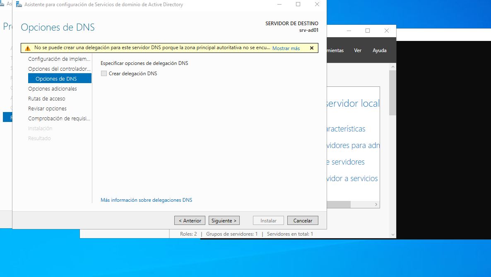

---

# Ejercicio 3 – Creación de usuarios

Se crearon los siguientes usuarios del dominio:

- usuario1
- usuario2

Desde la herramienta:

Usuarios y equipos de Active Directory

## Capturas

- ![\[CAPTURA usuario1\]](3.1.png)
- 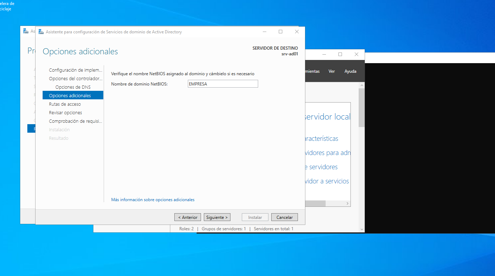
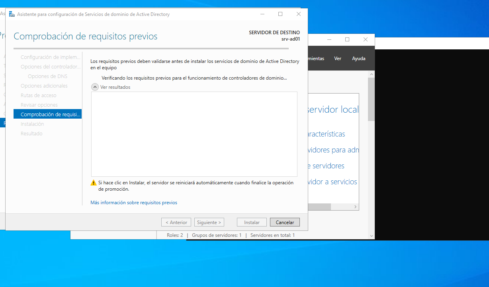
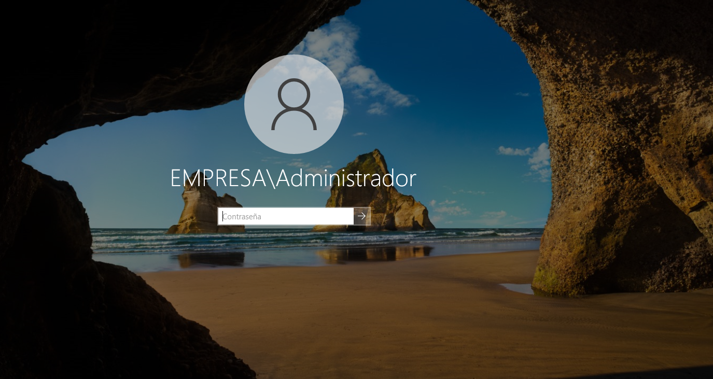

---

# Ejercicio 4 – Configuración de perfiles móviles

Se creó y compartió la carpeta:

C:\perfiles

Ruta compartida:

\\srv-ad01\perfiles

## Capturas

- 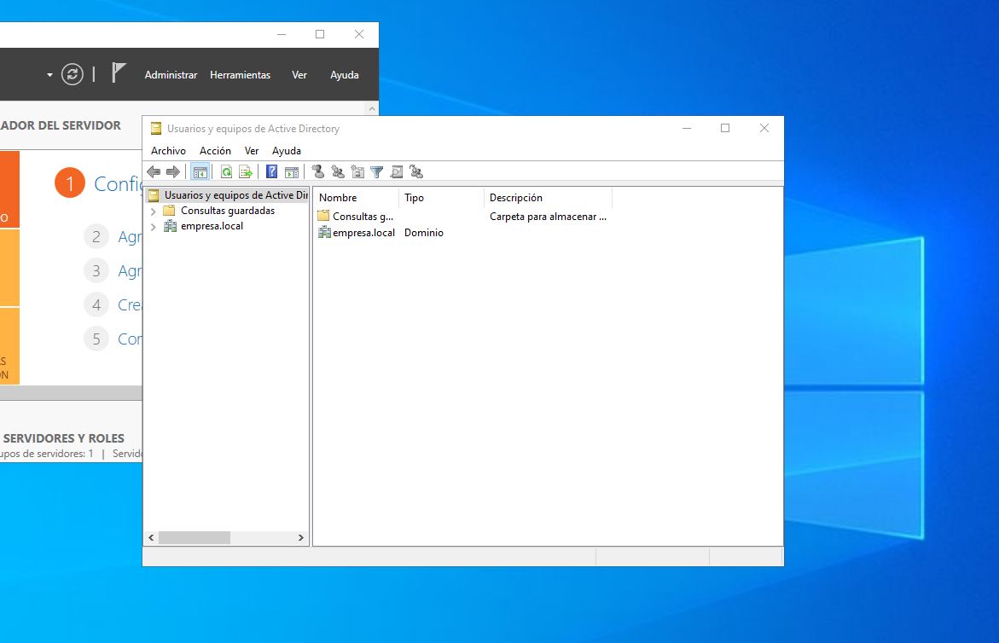

---

# Ejercicio 5 – Configuración de perfiles de usuario

En las propiedades de los usuarios se configuró la ruta del perfil móvil:

\\srv-ad01\perfiles\%username%

Ruta utilizada:

Perfil → Ruta de acceso al perfil

## Capturas

- 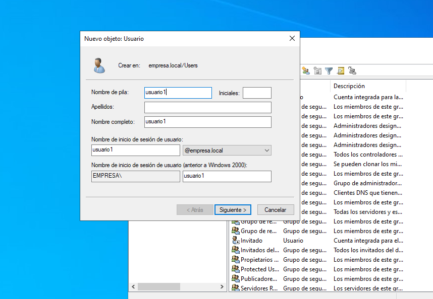

---

# Ejercicio 6 – Instalación de Windows 11

Se instaló Windows 11 como equipo cliente del dominio.

Nombre del equipo:

cli01

## Capturas

- ![\[CAPTURA Windows 11 instalado\]](6.1.png)

---

# Ejercicio 7 – Unión del equipo al dominio

El cliente Windows 11 se unió al dominio:

empresa.local

## Pasos realizados

1. Ejecutar:
   sysdm.cpl

2. Abrir:
   Nombre de equipo.

3. Pulsar:
   Cambiar.

4. Seleccionar:
   Dominio.

5. Introducir:
   empresa.local

## Capturas

- 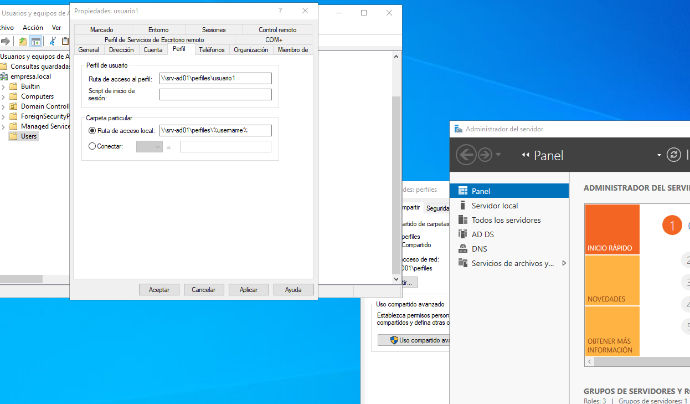
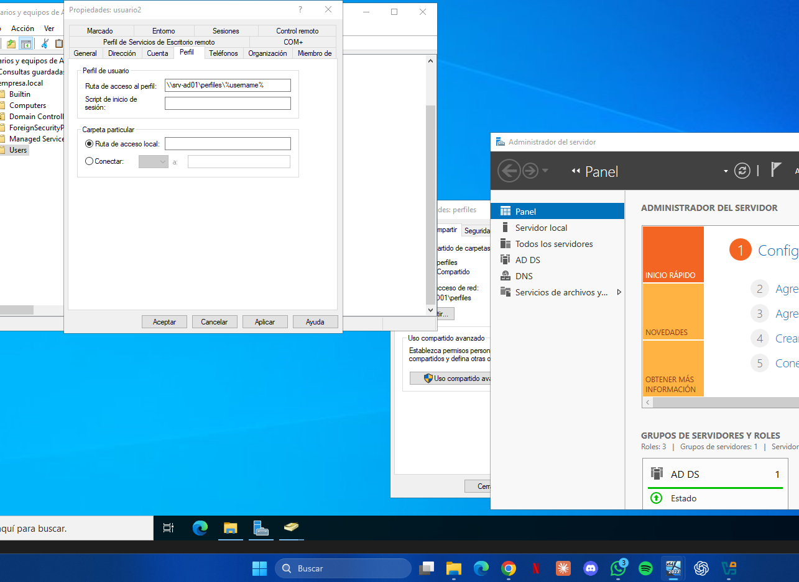

---

# Ejercicio 8 – Inicio de sesión con usuarios del dominio

Se inició sesión con usuarios del dominio:

- usuario1@empresa.local
- usuario2@empresa.local

Contraseña utilizada:

Admin1234*

## Observaciones

El usuario usuario1 inició sesión correctamente.

El usuario usuario2 presentó problemas relacionados con el perfil móvil, aunque la autenticación del dominio funcionó correctamente.

## Capturas

- ![\[CAPTURA login usuario1\]](<89bl men 8.png>)
- 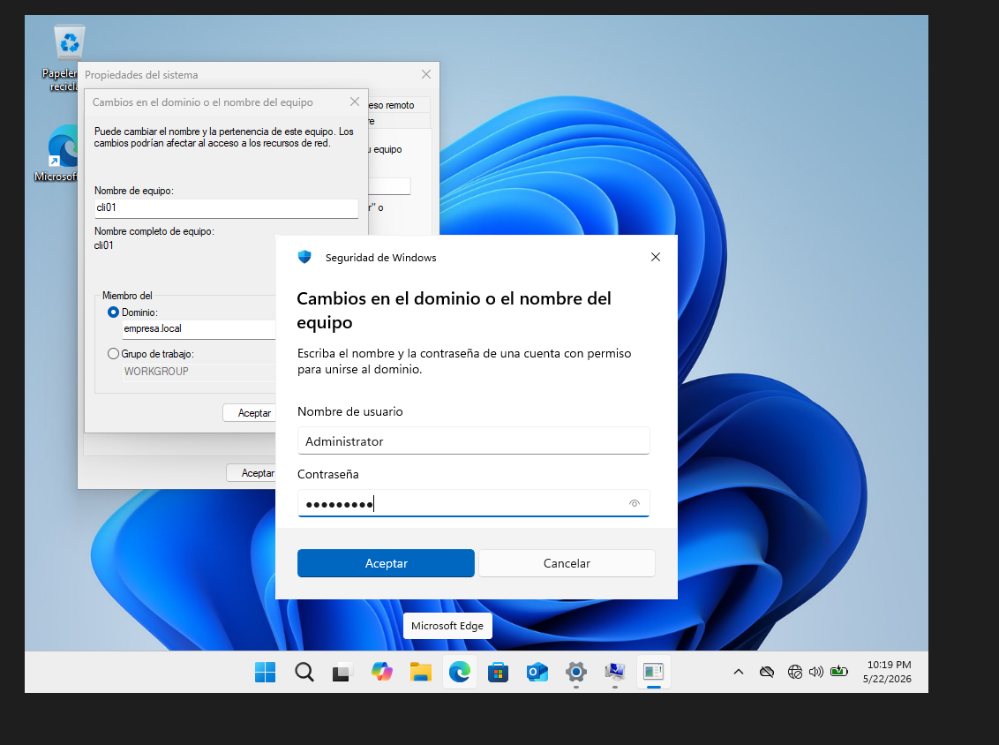
- 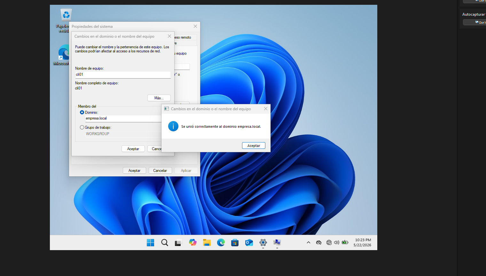

---

# Ejercicio 9 – Aplicación de perfiles móviles

Se comprobó el funcionamiento de los perfiles móviles desde el dominio Active Directory.

## Capturas

- 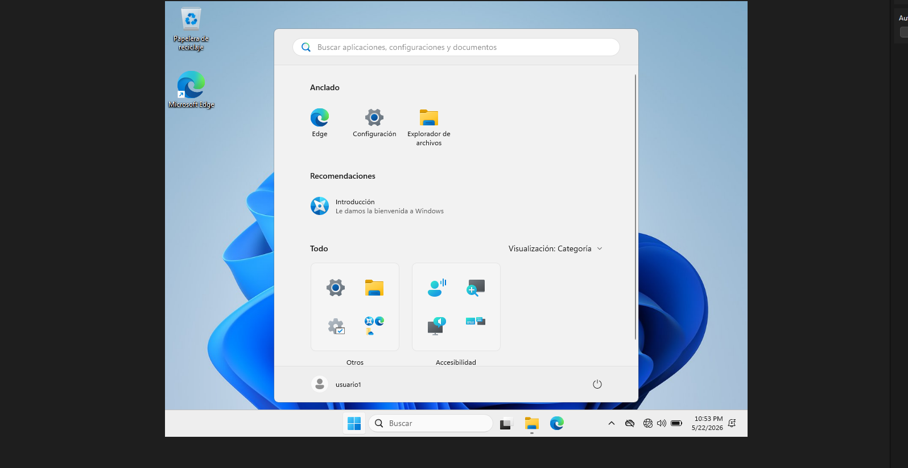

---

# Ejercicio 10 – Modificación de la política de contraseñas

Se modificó la política del dominio desde:

Group Policy Management

Política utilizada:

Default Domain Policy

## Ruta utilizada

Configuración del equipo
→ Directivas
→ Configuración de Windows
→ Configuración de seguridad
→ Directivas de cuenta
→ Directiva de contraseñas

## Cambio realizado

Longitud mínima de contraseña = 8

## Explicación de las GPO

Las Group Policy Objects (GPO) permiten administrar de forma centralizada la configuración de seguridad y comportamiento de usuarios y equipos dentro de un dominio Active Directory.

Las GPO permiten:
- Aplicar políticas de seguridad.
- Configurar contraseñas.
- Restringir accesos.
- Configurar usuarios y equipos automáticamente.

## Capturas

- 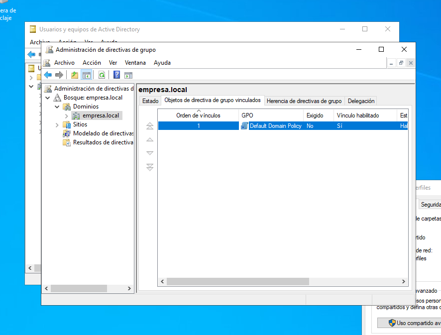
- 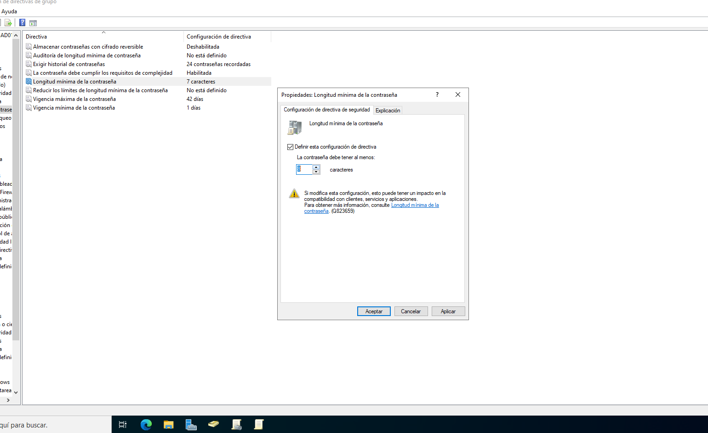

## Documentación consultada

Microsoft Learn – Group Policy Overview

https://learn.microsoft.com/en-us/windows-server/identity/ad-ds/manage/group-policy/group-policy-overview

---

# Ejercicio 11 – Actualización de políticas de grupo

En Windows 11 se ejecutaron los comandos:

gpupdate /force

y

gpresult /r

## Explicación

El comando gpupdate /force actualiza las políticas de grupo del dominio.

El comando gpresult /r permite comprobar las políticas aplicadas al usuario y al equipo.

## Capturas

- 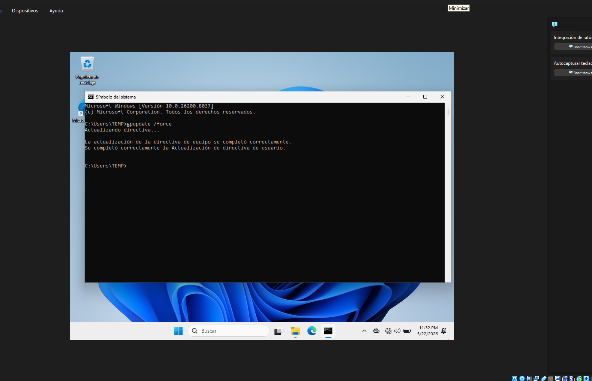
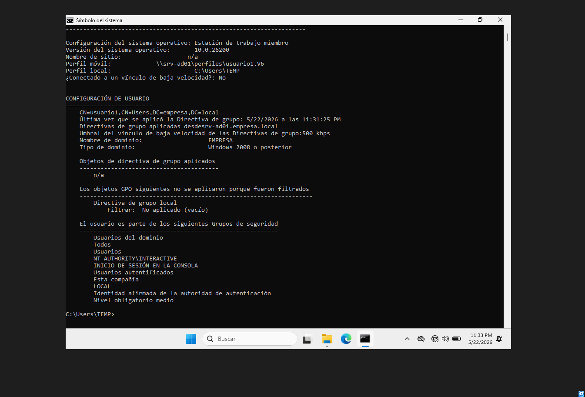

## Documentación consultada

Microsoft Learn – gpupdate

https://learn.microsoft.com/en-us/windows-server/administration/windows-commands/gpupdate

---

# Ejercicio 12 – Comprobación final del dominio

Se comprobó el correcto funcionamiento del dominio Active Directory:

empresa.local

## Verificaciones realizadas

### Servidor

Comando utilizado:

hostname

Resultado:

srv-ad01

### Cliente Windows 11

Comando utilizado:

hostname

Resultado:

cli01

### Dominio

El cliente Windows 11 quedó unido correctamente al dominio empresa.local.

## Capturas

- 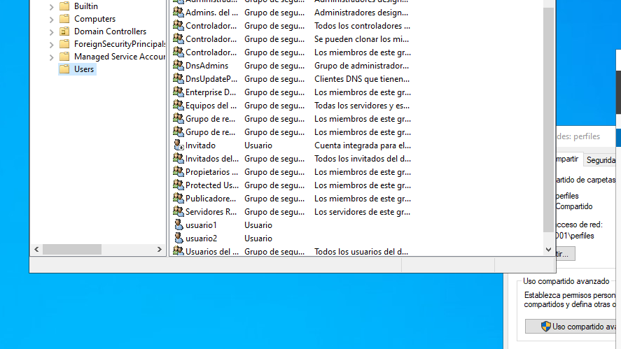
- 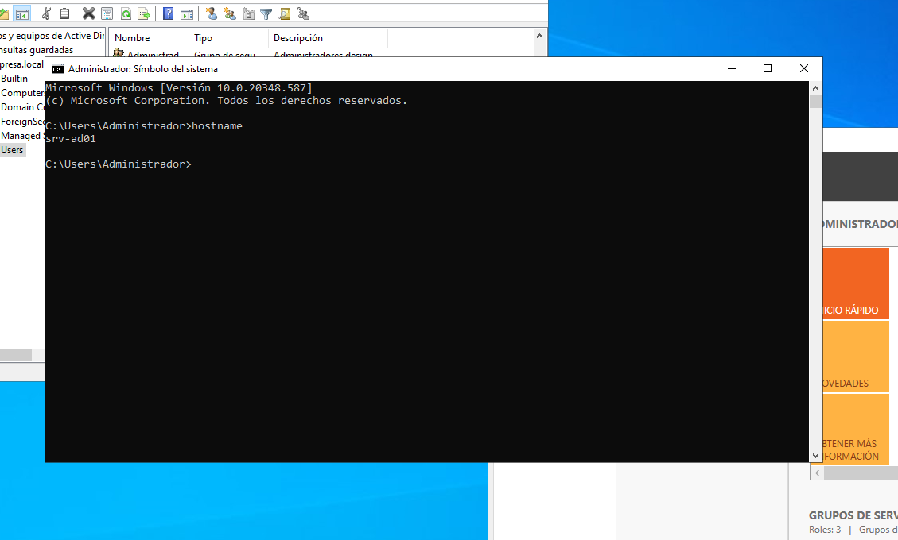
- 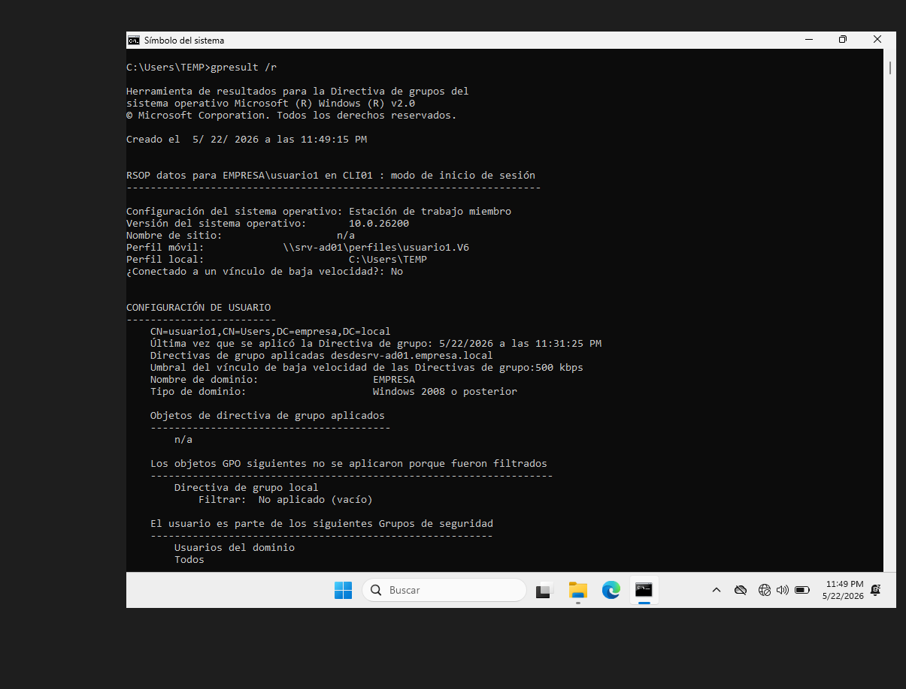

---

# Conclusión

Durante la práctica se instaló y configuró un controlador de dominio Active Directory utilizando Windows Server.

También se configuraron usuarios, perfiles móviles, políticas de grupo y un cliente Windows 11 unido al dominio.

Finalmente se comprobó el correcto funcionamiento de:
- Active Directory
- DNS
- Usuarios del dominio
- GPO
- Inicio de sesión desde el cliente